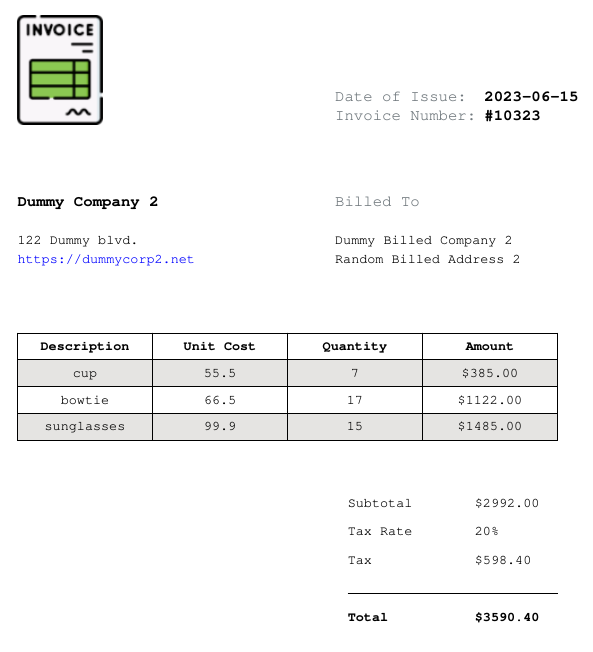

# InvoiceCRUD
#### Video Demo:  https://youtu.be/rEc1_e5fpHc
#### Description:
##### Main goal of the project is creation and storage of invoices. Implemented are different functionalities, some of which are hinted by the project name. 

<br>

##### Example of exported invoice as .pdf filetype.




##### Nevertheless the functionalities are as follows:
<br>

| Main functionalities | Description | Additional functionalities | Description |
| ------- | ------------------------ | ------- | ------------------------ |
| Create | Create invoice by filling required input fields, then INSERT to database | Create Account | Save user to database with unique username and hashed password |
| Search | Read invoice - fetch with query invoice from database based on user input | Login | Check if user exists, create local session, handle wrong credentials |
| Export | Export selected invoice as PDF file and present possibility to open it via browser | Logout | Clear current user session |
| Edit | Update/Edit concrete invoice - fetch and populate input fields, then edit them and finally UPDATE the database | | |
| Delete | Remove invoice from database based on user inputted identificator | | |

<br>

##### The project has the following simple structure:

```
/project
    app.py
    requirements.txt
    invoices.db
    /templates
    /static
    /exported
```
<br> 

##### The database invoices.db has the following .schema:
```
CREATE TABLE sqlite_sequence(name, seq);
CREATE TABLE users (
  id INTEGER PRIMARY KEY AUTOINCREMENT NOT NULL, 
  username TEXT NOT NULL, hash TEXT NOT NULL
);
CREATE UNIQUE INDEX username ON users (username);
CREATE TABLE invoices (
  invoice_id INTEGER NOT NULL, 
  invoice_number INTEGER NOT NULL UNIQUE, 
  company_name TEXT NOT NULL, 
  company_address TEXT NOT NULL, 
  company_website TEXT NOT NULL, 
  billed_company TEXT NOT NULL, 
  billed_company_address TEXT NOT NULL, 
  issue_date NUMERIC NOT NULL, 
  FOREIGN KEY(invoice_id) REFERENCES users(id)
);
CREATE TABLE products (
  product_id INTEGER NOT NULL, 
  description TEXT NOT NULL, 
  unit_cost DECIMAL NOT NULL, 
  quantity INTEGER NOT NULL, 
  FOREIGN KEY(product_id) REFERENCES invoices(invoice_number)
);

```
<br>

> The **requirements.txt** contains the required external libraries, which are **Flask**, **fpdf2** and **Werkzeug**.
<br>

> The project core logic is written inside **app.py**, handling user POST and GET requests, rendering the different .html templates and interaction with the database.
<br>

> All data for invoices, as well as data for users is stored in SQLite database file named **invoices.db**. The DB has three related tables named **users**, **invoices** and **products**. 
<br>

> Directory **templates** consists of eight .html files. The **layout.html** imports external libraries like jQuery, bootstrap and extends every other html. The **login.html** and **create-account.html** are the frontend for login and creating a user. If a user logs successfully, then the file **index.html** will present a simple navigation panel. Worth mentioning is that **index.html** extends all .html files that require login. The navigation is consisted of five nav-links that provide the user possibility to create, search, export, edit, delete invoices or logout. The **home.html** greets the logged in user by name and shows number of saved invoices. The **create-invoice.html** consists of many input fields that on POST request populate invoices.db with data. The **search-invoice.html** lists all created invoices in a table, but also presents the possibility to the user for exporting the selected invoice as PDF file. The **edit-invoice.html** is frontend for updating already stored invoice or deleting it. 
<br>

> Folder named **static** contains the web app images, as well as one .js and one .css file. The file **styles.css** handles a little bit of styling. All javascript logic is written inside **main.js** - *add* and *remove* logic for invoice products (create-invoice.html), datatable (search-invoice.html) and delete confirmation button (edit-invoice.html).
<br>

> Worth mentioning is that all invoices (PDF files) are saved in a folder named **exported**. When exporting an invoice the GUI will present an option to open the exported PDF file with the browser.  
<br>

###### *Credits:*
###### *Invoice icons created by Freepik - Flaticon*
###### <sub>https://www.flaticon.com/free-icons/invoice</sub>
